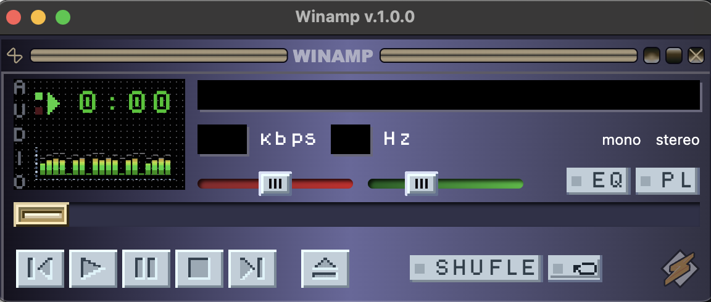

# Electron + React = Winamp ⚡

An example of using Electron to develop a desktop application.

## Preview

## How to start

- `npm i` or `yarn` install dependencies;
- `npm run start` or `yarn start` to lunch app in dev mode;
- Important! Add envs or comment sign section it the 'forge.config.ts' and run `npm run make` or `yarn make` to create build (DMG or EXE);

## Tech Stack

- **Electron (Electron Forge):** [Electron Forge](https://www.electronforge.io/)
- **React (TypeScript):** [React](https://reactjs.org/)
- **Vite:** [Vite](https://vitejs.dev/)
- **TailwindCSS:** [TailwindCSS](https://tailwindcss.com/)
- **Howler:** [Howler.js](https://howlerjs.com/)
- **Drag&Drop (react-dropzone):** [react-dropzone](https://www.npmjs.com/package/react-dropzone)
- **react-hook-form:** [React Hook Form](https://react-hook-form.com/)
- **react-router-dom:** [React Router](https://reactrouter.com/)

### Apple envs

- `VITE_APPLE_API_KEY_PATH`; // path to local key (key_name.p8)
- `VITE_APPLE_API_KEY_ID`;
- `VITE_APPLE_API_ISSUER`;
- `VITE_APPLE_APPSIGN_IDENTITY`;

Thanks for mockup
https://www.figma.com/design/iMKNADTGD3IIc2gMMUaQw3/Winamp-2023-(Autolayout)-(Community)?node-id=322-6155&t=gElWmVd6EsrkGqjL-0
